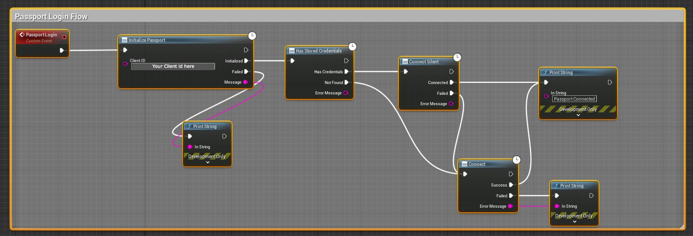
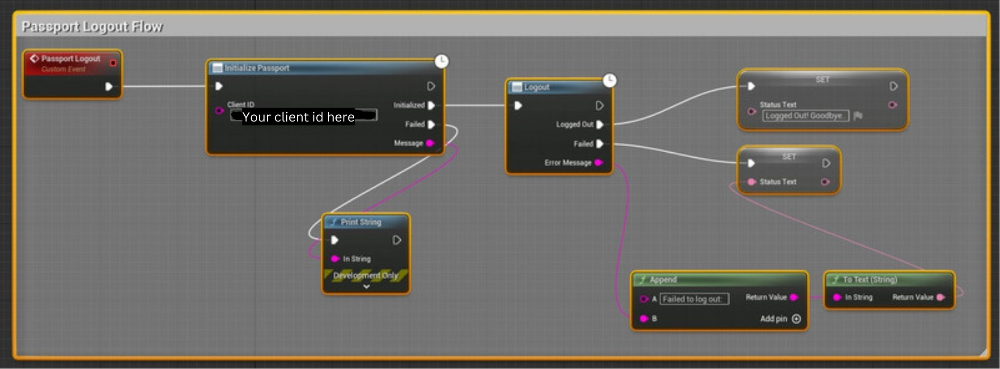
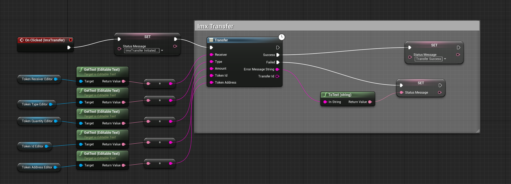
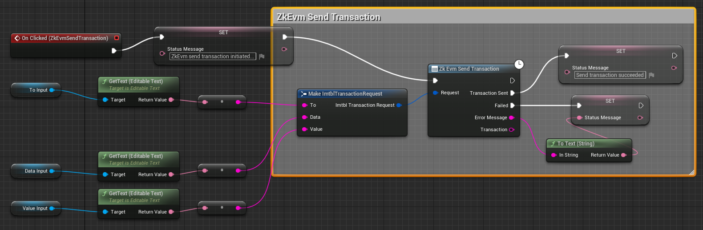
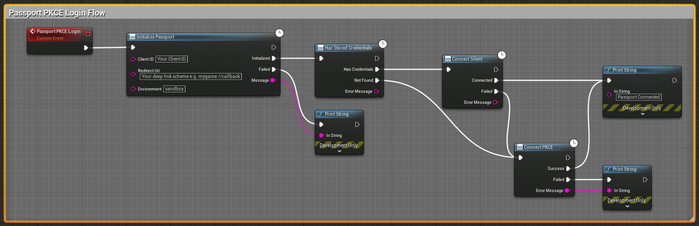
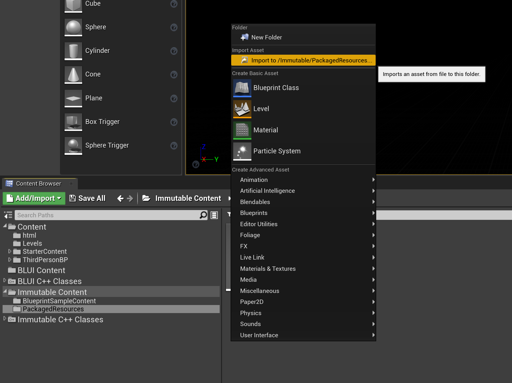

<div align="center">
  <p align="center">
    <a  href="https://docs.x.immutable.com/docs">
      
    </a>
  </p>
</div>

---

# Immutable SDK for Unreal Engine

## User Guide

### Supported Platforms

- Windows 10 (64-bit)
- MacOS (Unreal Engine 5.2+: [minimum version 12.5 Monterey](https://docs.unrealengine.com/5.2/en-US/macos-development-requirements-for-unreal-engine/))
- Android (minimum version 8.0)
- iOS (minimum version 13.0)

### Supported Unreal Engine Versions

- Unreal Engine 5.0 and above
- Unreal Engine 4.26 and above

## Registering your game

Before using Passport, you must register your application as an OAuth 2.0 **Native** client in the [Immutable Developer Hub](https://hub.immutable.com). First, you'll need to create a project and a testnet environment.
Then, you can navigate to the Passport config screen and create a passport client for your created environment.
When you're ready to launch your application on the mainnet, please ensure you configure a passport client under a mainnet environment. Here's how you can configure the fields while creating a client:

### Creating an OAuth2.0 Native client

#### Application Type
You must register your application as an OAuth 2.0 **Native** client.

#### Client name
The name you wish to use to identify your application.

#### Logout URLs
Native clients don't make use of Logout URLs, you might set your own website or https://localhost:3000 as this is a required field.

#### Callback URLs
On Android, iOS and macOS clients, you should set your application's deep link scheme (e.g. `mygame://callback`) if you wish to make use of [PKCE login](#android-and-ios-pkce-login-unreal-engine-50-only), otherwise set the same as [Logout URLs](#logout-urls).

[PKCE login](#android-and-ios-pkce-login-unreal-engine-50-only) is not supported on Windows clients. Hence, they do not use Callback URLs. You may set Callback URLs to be the same as [Logout URLs](#logout-urls), as it is a required field.

#### Web Origins URLs
Optional field. The URLs that are allowed to request authorisation. This field is available when you select the Native application type.

See [here](https://docs.immutable.com/docs/x/passport/register-application/) for more details.


### Installation

> :clipboard: Prerequisites
>
>[git-lfs](https://git-lfs.github.com/): since `.uasset` and `.umap` files are stored on Git Large File Storage, ensure you have [git-lfs]((https://git-lfs.github.com/)) installed.

1. Clone the [unreal-immutable-sdk](https://github.com/immutable/unreal-immutable-sdk) repository or download the zip/tarball from one of the versions [here](https://github.com/immutable/unreal-immutable-sdk/tags)
2. Copy the cloned repo into your project's `Plugins` folder, e.g.: `MyGame/Plugins/unreal-immutable-sdk`.
3. Restart your project (Unreal Editor & Rider), upon restart it should load the `unreal-sdk-plugin` and should be good to use.

> [!NOTE]
> For Unreal Engine 4.26 and above we use Blui as a browser instead of inbuilt browser.
> Install Blui Plugin only for UE4.
> Please update `immutable.uplugin->Plugins->WebBrowserWidget` to false and restart your UE4 editor.
> For Unreal Engine 5.0 and above we use inbuilt browser.

### Setup

#### Blueprint

See the included sample widgets in `All`->`Plugins`->`Immutable Content` in the Unreal Editor content browser for examples of how to use the plugin in Blueprint.  If you don't see a `Plugins` folder under `All` you may need to enable `Show Plugin Content` in the content browser's `Settings` menu.

#### C++

See `ImmutablePassport.h` for the C++ Passport API.  Follow the same sequence of steps as the Blueprint widget example to initialise and connect Passport and retrieve account data.

### Quick Start

#### Passport Login Flow

See this Blueprint showing how to login to passport 

Here are the steps to login to passport:

1. `Initialise Passport` to initialise passport instance.
2. Check if there are stored credentials from previous login.
3. If stored credentials found, `ConnectSilent` uses the saved credentials to login to Passport.
4. When no stored credentials found or step 3 fails, attempt to make a new Connection to login to Passport using `Connect`. This will open the gamer's default browser and take them through the auth flow.

Once the gamer is connected to Passport, the SDK will store your credentials (access, ID, and refresh tokens).

> [!NOTE]
> We use the [Device Code Authorisation](https://auth0.com/docs/get-started/authentication-and-authorization-flow/device-authorization-flow#:~:text=Your%20Auth0%20Authorization%20Server%20redirects,authorized%20to%20access%20the%20API.) flow to authenticate and authorise gamers.

#### Log out of Passport

See this Blueprint showing how to logout from passport 

#### Imx Transfer

> Note: The transfers feature require pre-approval from Immutable. Please [contact us](https://docs.immutable.com/docs/x/contact/) before making use of it.

To transfer tokens of type ETH, ERC20 or ERC721 use `UImmutablePassport::ImxTransfer` method. See this Blueprint example showing how to use Imx Transfer



To transfer multiple NFTs in a single transaction use `UImmutablePassport::ImxBatchNftTransfer` method. See this Blueprint example showing how to use Imx Batch Nft Transfer


#### zkEVM Send Transaction

To send a transaction on zkEVM use `UImmutablePassport::ZkEvmSendTransaction` method. See this Blueprint example showing how to use Zk Evm Send Transaction



### Android and iOS PKCE login (Unreal Engine 5.0+ only)

For Android and iOS, you can use the [Authorization Code Flow with Proof Key for Code Exchange (PKCE)](https://auth0.com/docs/get-started/authentication-and-authorization-flow/authorization-code-flow-with-proof-key-for-code-exchange-pkce) login flow instead of [Device Code Authorisation](https://auth0.com/docs/get-started/authentication-and-authorization-flow/device-authorization-flow#:~:text=Your%20Auth0%20Authorization%20Server%20redirects,authorized%20to%20access%20the%20API.). This means the gamer has one less step to complete and will be redirected back to the game after successfully authenticating.

To use this flow you will need to:

1. Define a deep link scheme for your game (e.g. `mygame://callback`)
2. Login to the [Immutable Developer Hub](https://hub.immutable.com/) and add the deeplink to your clients **Callback URLs** and **Logout URLs**
3. Set this deep link as your redirect URI in `Initialize Passport`



#### Unreal Editor Android setup

1. In Unreal Editor go to **Project Settings** -> **Android** -> **Advanced APK Packaging**
2. Add the following code inside the **Extra Settings for \<activity> section (\n to separate lines)** field:

```XML
<intent-filter>\n<action android:name="android.intent.action.VIEW" />\n<category android:name="android.intent.category.DEFAULT" />\n<category android:name="android.intent.category.BROWSABLE" />\n<data android:host="callback" android:scheme="mygame" />\n</intent-filter>
```

The application will now open when the device processes any link that starts with `mygame://callback`.

#### Unreal Editor iOS setup

1. In Unreal Editor go to **Project Settings** -> **iOS** -> **Extra PList Data**
2. Add the following code inside the **Additional Plist Data** field:

```
<key>CFBundleURLTypes</key><array><dict><key>CFBundleURLSchemes</key><array><string>mygame</string></array></dict></array>
```

After this set-up and the redirect URI you set in `Initialize Passport`, your game can log in using `mygame://callback`.

See the [sample game](https://github.com/immutable/sample-unreal-game) for an example of how to set up PKCE for Android and iOS.

## Supported Functionality


| Method	                     | Description                                                                                                                                                                                                                                                                    |
|-----------------------------|:-------------------------------------------------------------------------------------------------------------------------------------------------------------------------------------------------------------------------------------------------------------------------------|
| Connect	                    | Log into Passport using [Device Code Authorisation](https://auth0.com/docs/get-started/authentication-and-authorization-flow/device-authorization-flow#:~:text=Your%20Auth0%20Authorization%20Server%20redirects,authorized%20to%20access%20the%20API.)                        |
| ConnectSilent	              | Attempts to login using stored credentials                                                                                                                                                                                                                                     |
| ConnectPKCE	                | (Android and iOS on Unreal Engine 5.0+ only) Log into Passport using [Authorization Code Flow with Proof Key for Code Exchange (PKCE)](https://auth0.com/docs/get-started/authentication-and-authorization-flow/authorization-code-flow-with-proof-key-for-code-exchange-pkce) |
| CheckStoredCredentials	     | Checks if there are stored credits from previous login                                                                                                                                                                                                                         |
| GetAddress	                 | Gets Wallet Address                                                                                                                                                                                                                                                            |
| GetEmail	                   | Get Email Address associated with the Wallet Address                                                                                                                                                                                                                           |
| ImxTransfer    	            | ImxTransfer used to send tokens of type ETH, ERC20, ERC721 to reciever's address                                                                                                                                                                                               |
| ImxBatchNftTransfer    	    | ImxBatchNftTransfer used to send multiple Nft tokens in a single transaction to reciever's address                                                                                                                                                                             |
| GetEmail	                   | Get Email Address associated with the Wallet Address                                                                                                                                                                                                                           |
| zkEVM request accounts    	 | This method attempts to authenticate the user and initialises their Passport wallet before returning an array of wallet addresses                                                                                                                                                                                                       |
| zkEVM get balance    	      | Returns the balance of the account of given address in wei                                                                                                                                                                                                                                         |
| zkEVM send transaction    	         | Creates new message call transaction or a contract creation, if the data field contains code                                                                                                                                                                                                                              |


See the [ImmutablePassport.h](https://github.com/immutable/unreal-immutable-sdk/blob/dc39324db204f2ba30e9c9f0ca25c070987785cb/Source/Immutable/Public/Immutable/ImmutablePassport.h#L115C8-L115C8) header for the full API.

## Examples

- **Sample Blueprints** - see the [sample blueprints](https://github.com/immutable/unreal-immutable-sdk/tree/main/Content/BlueprintSampleContent) for examples of how to use the Immutable Unreal SDK.

- **Sample Game** - see the [sample game](https://github.com/immutable/sample-unreal-game) for example of how to use the Immutable Unreal SDK.

## Plugin Maintainers' Guide

### Prerequisites

- git
- Epic Games Launcher
- Unreal Engine installed from the Epic Games Launcher; you will need every version that the plugin supports (currently 4.27, 5.0, 5.1, 5.2)
- Visual Studio 2022 with C++ support
- Jetbrains Rider IDE (recommended for working with Unreal Engine C++ code)

If not Rider, Visual Studio is fine and even better with the Resharper plugin.

### Getting Started

See [user guide](#user-guide) to install the plugin, with one caveat:  If you want to open the project and plugin in an IDE you'll need to create your Unreal project as a C++ project.  If you've already accidentally created your Unreal project as BluePrint-only you can convert it to a BluePrint-and-C++ project by adding any C++ class from the `Add New C++ Class` option in the Unreal Editor's `File` menu.

### Debugging the Embedded Browser

#### Embedded Browser Logs

See `Saved/Logs/cef3.log` in your Unreal project.

#### JS Console Output

In Unreal Engine 5.1+ the project is set up so that `console.log()` will pass all the way through to the Unreal console.  This isn't available in UE5.0 and earlier but you can still use Chromium's remote debugging (see below).

#### Remote Debugging

To set up Chromium remote debugging, edit project build/launch configurations in your IDE to add the following program command line argument to the appropriate configurations: `cefdebug=9222`

Next, launch the game and then open a separate Chrome/Chromium browser and navigate to `chrome://inspect` where your app should be listed, sometimes intermittently or after a delay, under the `Remote Target #localhost` section.  Click `inspect` to launch the remote debugging session.

## Release Unreal Immutable SDK Plugin

1. Release the plugin using github releases. See https://github.com/immutable/unreal-immutable-sdk/releases

## Release Blui Plugin for UE4

For UE4 we are using Blui as the in built browser does not work.

1. Download this release supporting UE 4.27 and 4.26 https://github.com/getnamo/BLUI-Unreal/releases/tag/4.2.0
2. Download the CEF 90 Browser from https://github.com/getnamo/BLUI-Unreal/releases/tag/v4.6.0 (`BluBrowserCEF....7z`)
3. Delete the Thirdparty/cef/Win folder from the BLUI plugin
4. Place the Win folder from the `BluBrowserCEF...7z` into Thirdparty/cef
5. Disable cefdebug settings in `Blu.cpp`, following line
    ```
    // BluManager::Settings.remote_debugging_port = 7777;
    ```
6. Zip the Blui plugin folder and upload to the github release.

## How to Add Game Bridge Asset to Packaged Resources

1. Open Unreal Editor in the lowest supported version i.e, 4.26 for this Plugin.
2. Open Content Drawer
3. Navigate to Plugins -> Immutable Content -> Packages Resources
4. Delete the existing imported asset if you wish to replace with new one
5. Right Click and Import the `index.js` file
    


## Changelog Management

The following headings should be used as appropriate.

- Added
- Changed
- Deprecated
- Removed
- Fixed

What follows is an example with all the change headings, for real world use only use headings when appropriate.
This goes at the top of the CHANGELOG.md above the most recent release.

```markdown
...

## [Unreleased]

### Added

for new features.

### Changed

for changes in existing functionality.

### Deprecated

for soon-to-be removed features.

### Removed

for now removed features.

### Fixed

for any bug fixes.

...
```

## Contributing

If you would like to contribute, please read the following:

- We use the [Conventional Commits specification](https://www.conventionalcommits.org/en/v1.0.0/#specification) when writing our commit messages. Why use Conventional Commits? Read [here](https://www.conventionalcommits.org/en/v1.0.0/#why-use-conventional-commits).

## Getting Help

Immutable X is open to all to build on, with no approvals required. If you want to talk to us to learn more, or apply for developer grants, click below:

[Contact us](https://www.immutable.com/contact)

### Project Support

To get help from other developers, discuss ideas, and stay up-to-date on what's happening, become a part of our community on Discord.

[Join us on Discord](https://discord.gg/TkVumkJ9D6)

You can also join the conversation, connect with other projects, and ask questions in our Immutable X Discourse forum.

[Visit the forum](https://forum.immutable.com/)

#### Still need help?

You can also apply for marketing support for your project. Or, if you need help with an issue related to what you're building with Immutable X, click below to submit an issue. Select _I have a question_ or _issue related to building on Immutable X_ as your issue type.

[Contact support](https://support.immutable.com/hc/en-us/requests/new)

## License

Immutable Unreal SDK repository is distributed under the terms of the [Apache License (Version 2.0)](LICENSE).